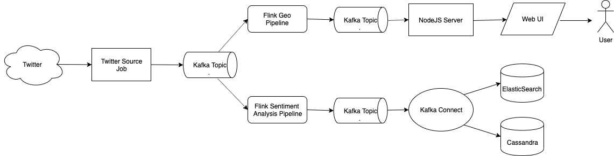

# Twitter realtime pipeline

This repository contains an example of Twitter realtime analysis pipeline.

The high level design looks like this:

Dependencies:
- Kubernetes
- Google Cloud SDK (optional to create a Kubernetes cluster)

## How so start 

### 1. Setup Twitter credentials.
- Log in into Twitter 
- [Apply for a developer account](https://developer.twitter.com/en/apply)
- [Create an application](https://developer.twitter.com/en/apps/create)
- Set Keys and Tokens
    * `echo {CONSUMER_KEY} > k8s/.env/CONSUMER_KEY`
    * `echo {CONSUMER_SECRET} > k8s/.env/CONSUMER_SECRET`
    * `echo {TOKEN} > k8s/.env/TOKEN`
    * `echo {TOKEN_SECRET} > k8s/.env/TOKEN_SECRET`

### 2. Create and deploy kubernetes cluster
- `make cluster`  (this command will create cluster)
- `make initialize` (this command installs `helm` and `secret` with Twitter credentials)
- wait for couple of minutes
- `make infra1` (this command installs kafka/cassandra/flink/es)
- wait until `kubectl pods` shows that all 3 instances of each cassandra and kafka are up and running
- `make infra2` (this command initializes cassandra tables and kafka connect sinks)
- `make start` (this command will start the actual pipelines and ui)

## How to see the results:
- UI: `kubectl get service/ui-app-svc -o jsonpath='{.status.loadBalancer.ingress[0].ip}'` will give you an ip and then open http://{ip}:8080
- Kibana: `kubectl get service/kibana-rest -o jsonpath='{.status.loadBalancer.ingress[0].ip}'` will give you an ip and then open http://{ip}:5601
- Cassandra: `echo "select count(*) from ks.twitter_sentiment_analysis; exit" | kubectl exec -i cassandra-client cqlsh cassandra` 

## Example of how UI should look like:

